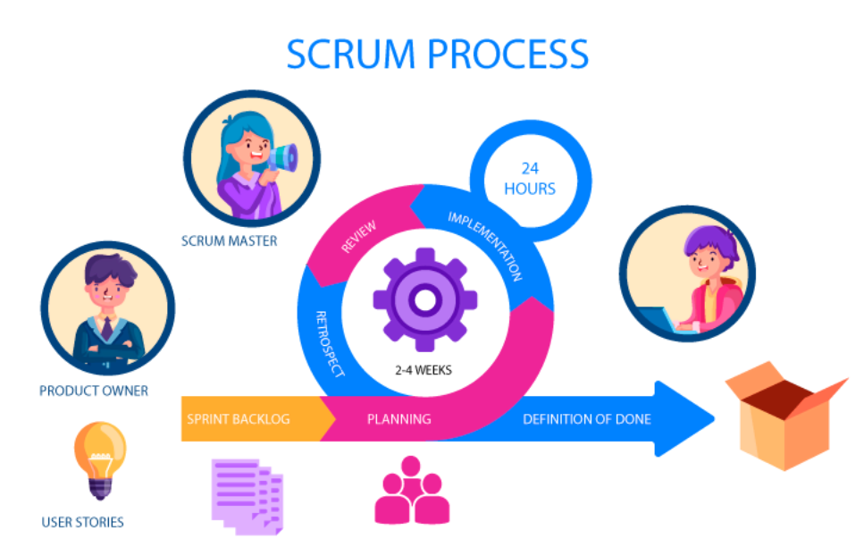
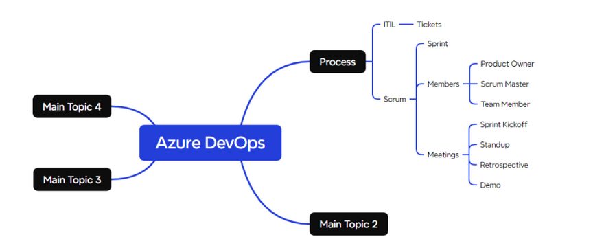

# Two frameworks of How DevOps Teams are assigned Work

   * ITIL
   * Agile (Scrum)

# ITIL

  * This represents a process followed by central IT Teams of your enterprise.
  * Tickets will be raised which will be assigned to team.
  * Tools: 
     * Service Now
     * Remedy
     * Azure DevOps

# Agile (Scrum)

   

# Azure DevOps

  * Azure DevOps is an Application Lifecycle Management Tool
  * This can handle
  * Process:
      
      * Scrum
      * ITIL
      * Kanban
  
  * Git
  * DevOps (CI/CD Pipelines)
  * Artifacts
  * Test Managemen
  * What we would be learning
  
      * Azure DevOps for source code managment. 
         * Git
         * TFVC
     
      * CI/CD Pipelines 
         * Classic Pipelines (UI)
         * YAML Pipelines    
      
      * Artifacts

* Note:

    * Install xmind community edition   
    * Try creating a mindmap for every tool which comes across

 

