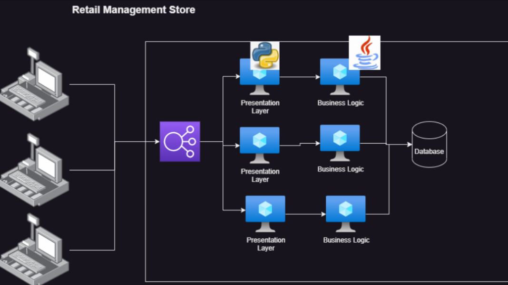
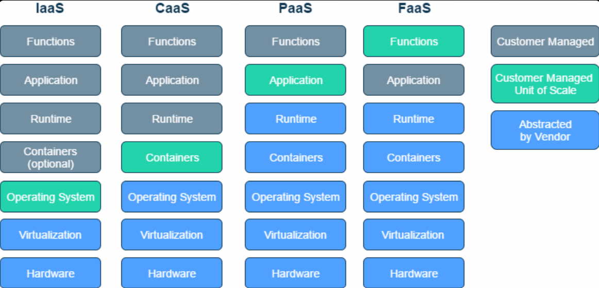
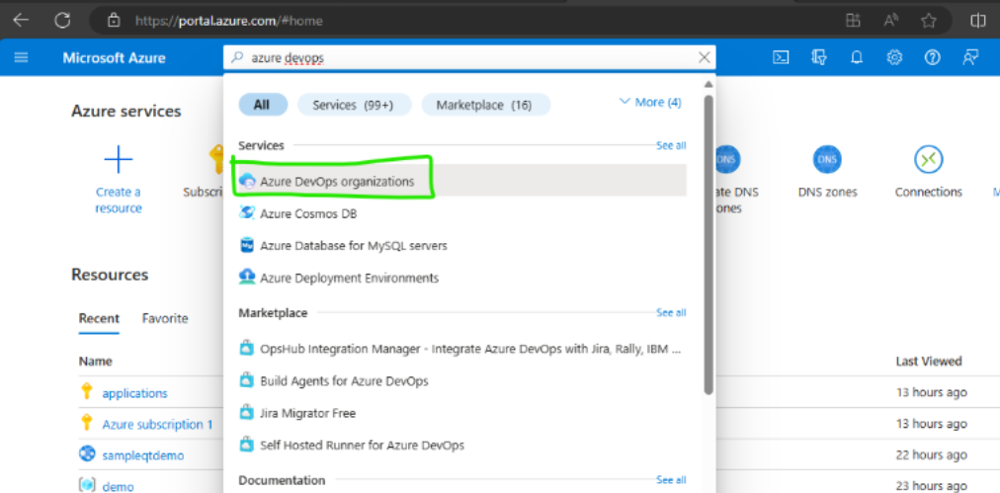
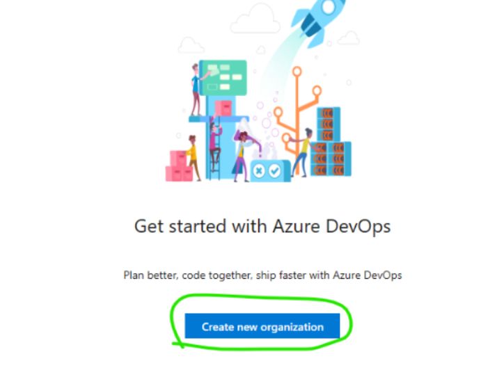
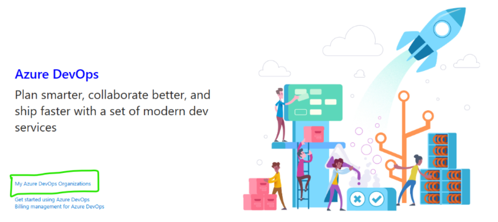
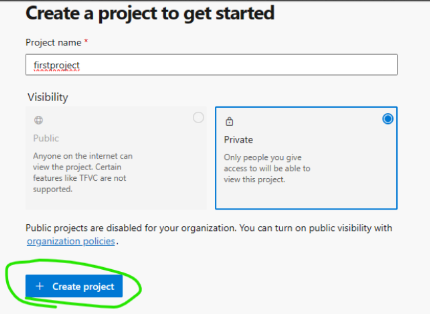

# CI/CD Pipeline by project types

* Virtual Machine Based Deployments
* Containerized Deployments
* Cloud Based
    * PaaS
    * FaaS Deployments

# Virtual Machine Based Deployment

   * In this mode of deployment, Applications run on virtual machines
   * We need to ensure virtual machines are up and running
   * Then deploy platform and package into virtual machine
    
   * We would need to create multiple environments as well.
       
       * dev
       * qa
       * uat/pre-prod/staging
       * prod/live

# Containerized Deployments

   * In this mode, there are many options but we would be using kubernetes based deployments
   * We need to ensure the kubernetes cluster is up and running
   * Then we need to deploy application into k8s using manifests.

# Cloud based Paas or FaaS Deployments
    
   

   * In this mode, your applications are configured to run on PaaS offerings by Major cloud provider  
   
   * For all the deployments our job is to the following things (at bare minimum)
        * build or package the code
        * create or update dev environment and deploy
        * create or update qa environment and deploy
           * execute automated tests and show test results.
        * create or update other environment and deploy   

* Static Code Analysis would be added to the pipelines for every change done by developer to meet your organizational standards (Sonarqube)

* Software composition analysis: Checking for security issues in every component which we
depend on 

* PaaS provides a platform for running entire applications, while FaaS allows running individual functions in response to events. Both models aim to abstract away infrastructure management, allowing developers to focus on building and deploying applications.

# Azure DevOps Setup (Azure Account Setup)

  * Ensure you have azure account
  * Login into Azure with your credentials 
      
      
          
  * Now enter organization detail
  * Now enter project details
      
  * Azure DevOps also has extensions from Azure DevOps MarketPlace : https://marketplace.visualstudio.com/azuredevops
  * Non Azure Account:
  * Create Github account 
      * Refer Here: https://github.com/