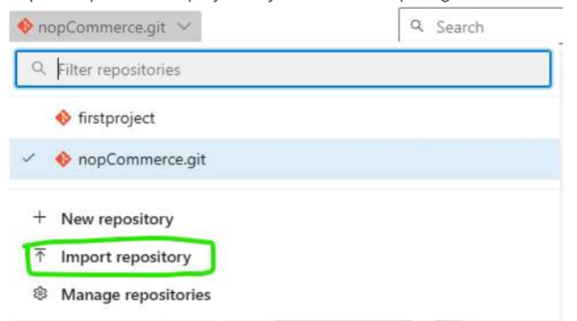
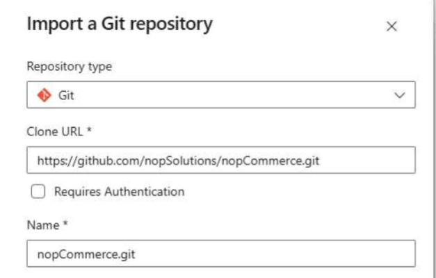
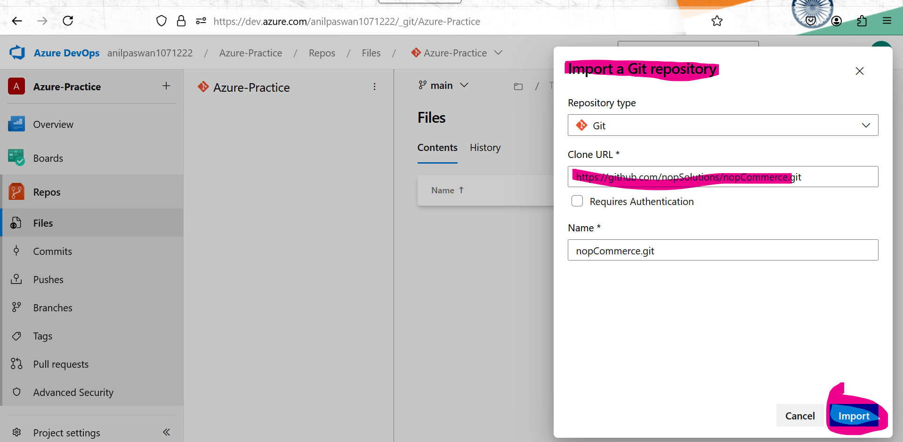
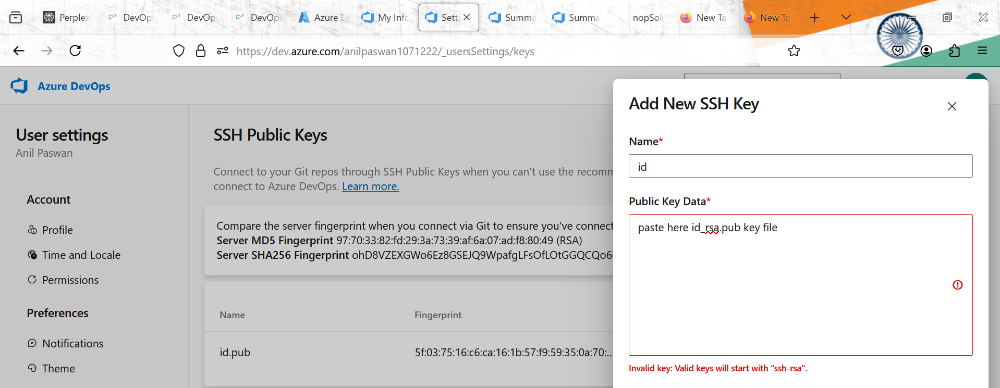
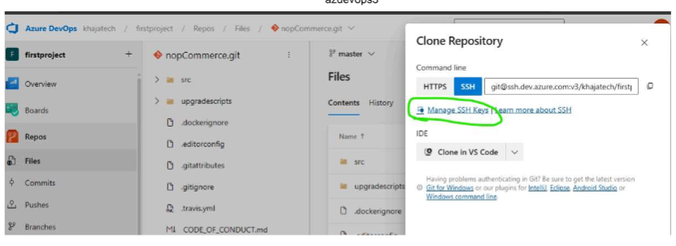

# Azure Devops 

# Source Control Management (Version Control System)

  * This software allows 
       * to have versions for every change done.
       * multiple developers to parallel work/contribute 
       * handeles release/different customers by branching
 
  * Terms: 
       
       * Repository: Repository is a storage location which maintains history of changes (versions)  
       
       * Source code Repository : 
               * This is some kind of storage location which is use for storing code pull the programming stuff configuration, terraform,kubernetes stuffs and Ansible playbook stuffs whatever you are writing you store here.
       
       * Package Repository : 
               * Everyday you are building a code where we generate packages so we store them also but we are not storing in folder we are store in repository what do i mean by i can downloads todays build and i can also downloads last mont build its maintains all the changes/things. 
       
       * Docker Image Repository:
               * storage location which maintain the history which become a history
 
  * Version Control System
  
       * Client Server Version Control System 
       * Distributed Version Control System 
           * any system can act as a server and for serving code
  * Git: 
       
       * gitolite
       * Simple And Powerful 
       * minimal administration
       * Git Hosting Options
            * Self Hosted
            * Cloud Hosted 
                * Azure Source Repo
                * Aws Code Commit  
                * GitHub
                    * Home for OpenSource software 
                * GitLab
                * BitBucket   
  
  * Azure Devops Source Repository:
  
       * Git 
       * TFVC (Team Foundation Version Control ) 

# Minimal operations with Git Version Control in Azure source repo

 * Creating Repository
 * Cloning code into local system 
 * Make changes 
 * push the changes to Azure source repo

# Import any project form Github into Azure source repo

 * Import repo from the project in your Azure Devops organization 
 * copy https code from github or gitlab
  
 
  

# Create a new repository and set it up in your system 

 * Hosted Git Repositories work with two options 
    * https: 
       * username and password 
       * username and tokens 
    
    * ssh/git
       * key based authentication 
           
         
        