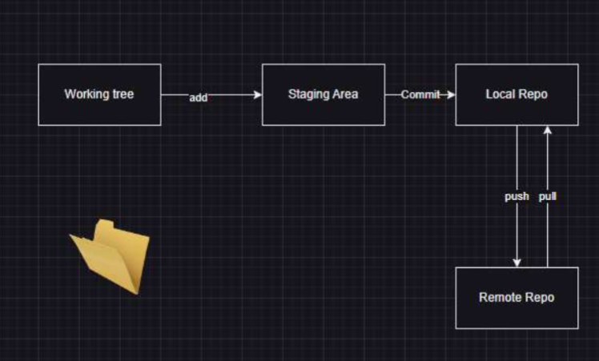
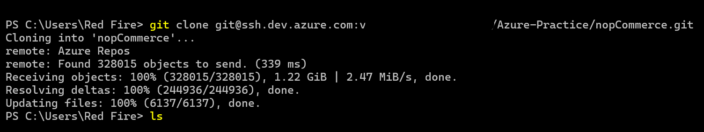
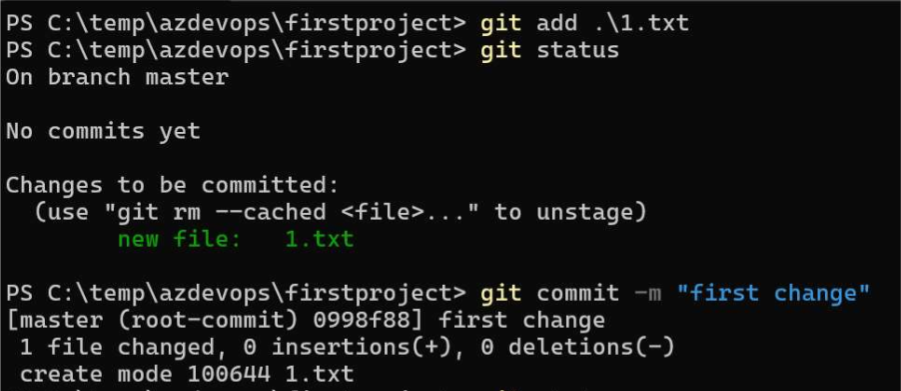

## Git cont

  * 4 areas of git 
  

  * working tree: folder
     * this is where we make changes
     
  * Staging area:
     * (logical => open cartoon)
     * this is to group changes 
 
  * local repository: 
     * (commits => sealed cartoon box with label)
     * this is where we create commit 

  * remote repository: 
     * here we ship closed carton boxs 
     * this is where all the commits from your team will be stored 

# Git

  * Always start with a cheatsheet 
  * search for examples over internet 
  * Read the manual `git --help`

# First steps 

  * we need to specify author information 

```
git config --global user.name "paswanil"
git config --global user.email "paswanil@gmail.com"

```  

 * if the ssh key is not generated in your system  
   * type in window terminal `ssh-keygen`
 
 * you should see couple of files 
```
~/.ssh/id_rsa  (private)
~/.ssh/id_rsa.pub (public)
```
 * if you don't have a copy of repository then we perform clone operation `git clone <url>`  
 
 
 * `git status` is the command which shows the status of a local repository 

 * Lets add the commit the changes 
 

# Building or packaging the code 

  * we need to take the source code and ensure we have a suitable package to run on target servers 
  * this is different for each technology 
     * Java: Maven
     * .net: msbuild.  