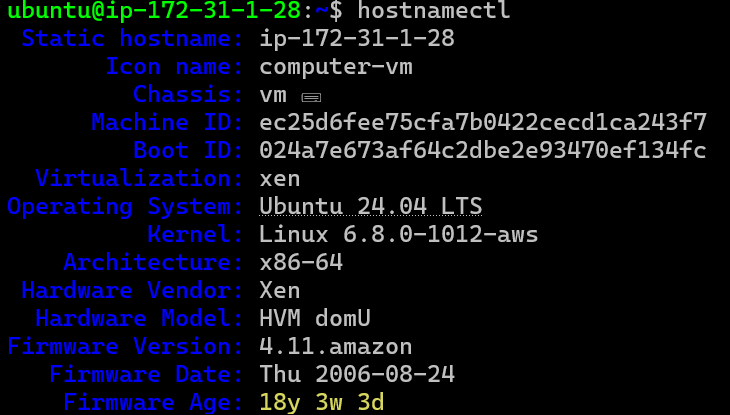

                 13 march 2024

* Linux command `hostnamectl`
 

# Building Java Code using maven

*  Maven is a tool to  build code using java based languages 
*  The other popular tools used in Java 
    * ANT
    * Gradle

* To use maven, we need to install some version of Java    

# Activity 1: Setup maven and build the code

  * Lets create a linux vm
  * install java 17
```
sudo apt update
sudo apt-cache search java17/openjdk-17-jdk
sudo apt install openjdk-17-jdk -y
```
  * now Installing maven  `sudo apt-cache madison maven`
  * refer 1: https://www.digitalocean.com/community/tutorials/install-maven-linux-ubuntu#installing-maven-on-linux-ubuntu
  * refer: https://maven.apache.org/download.cgi
```
cd /tmp
wget https://dlcdn.apache.org/maven/maven-3/3.9.9/binaries/apache-maven-3.9.9-bin.tar.gz
tar -xvf apache-maven-3.9.9-bin.tar.gz
sudo mv apache-maven-3.9.9 /opt/
```
# Setting M2_HOME and Path Variables
 
 * Add the following lines to the user profile file (.profile).
   `sudo vi ~/ .bashrc` then 
```
M2_HOME='/opt/apache-maven-3.9.9'
PATH="$M2_HOME/bin:$PATH"
export PATH
```
  * `source ~/ bashrc` and mvn --version
  * Lets try building the package for spring petclinic 
  * Refer Here: 
  ```
  https://github.com/spring-projects/spring-petclinic.git
  cd spring-petclinic
  mvn package 
  ```
 

  *  artifact path: target/spring-petclinic-3.3.0-SNAPSHOT.jar
  *  How to run

```
java -jar spring-petclinic-3.3.0-SNAPSHOT.jar
```


# Activity 2: Building .net code
 
  * project 2: 
  * softwares:  
      * dotnet 8  refer: https://learn.microsoft.com/en-us/dotnet/core/install/linux-ubuntu-install?pivots=os-linux-ubuntu-2204&tabs=dotnet8
       
      * commands
      ```
      sudo apt-get update && \
      sudo apt-get install -y dotnet-sdk-8.0
      ``` 
  * Clone the git and create a package
     
     
     ```
     https://github.com/nopSolutions/nopCommerce.git
     cd nopCommerce
     mkdir published
     dotnet publish -c Release src/Presentation/Nop.Web/Nop.Web.csproj -o published/
      ```
  * artifacts: published/
  * how to run the application

    ```
    cd published
    dotnet Nop.Web.dll --urls "http://0.0.0.0:5000"
    ``` 
    
    
#

in dotnet 
after dependency is downloaded then it will create a package in dot.net or java u will see this in the format of `.jar , war file or erf files ` and in the case of dot.net you would be find `exc or dll file ` you will see `.dll` 
this dotnet publish file and mvn package file all are same. 

--------------------------------------------------------------------------------------------------------------------