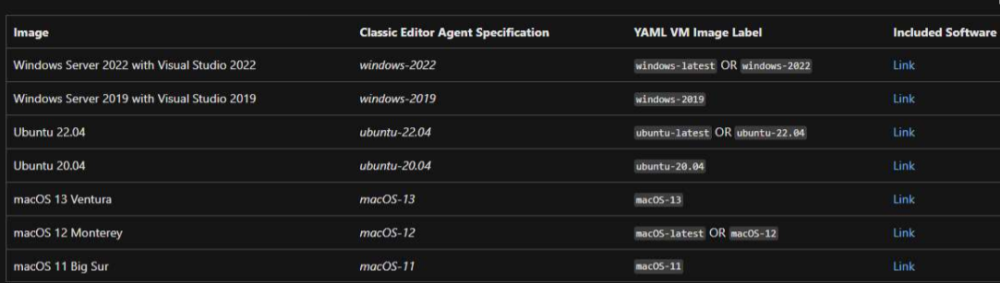
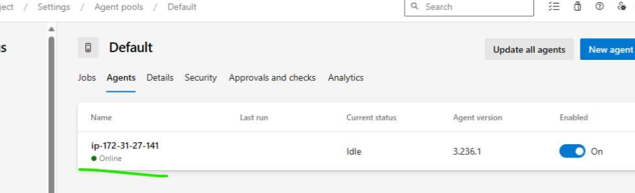

# How Azure Devops Pipelines Execute 

  * Azure Devops Executes Pipelines on Agent 
  * Azure Devops has two types of Agents 
    * Microsoft Hosted Agents: 
        * These are created and Managed by Azure Devops 
        * These are chargeable 
        * Supported OS:
            * Windows 
            * Linux
            * Mac
        * The agents come with predefined softwares and names 
        * Agents list 
        * azure devops microsoft hosted agents:
            * refer: https://learn.microsoft.com/en-us/azure/devops/pipelines/agents/hosted?view=azure-devops&tabs=yaml 
        

    * Self Hosted Agents 
     
       * These are created and managed by users 
       * We configure azure devops agents in these machines and azure devops tries to execute builds in it.       
       * Supported OS:
           * Windows 
           * Linux
           * Mac
  
  * Price Plans: 
       
       * Free: 
           * 1 microsoft hosted agent is free (1800 minutes of CI/CD)  
           * 1 self hosted agent is free
       
       * Paid: 
           * 1 microsoft hosted agent => 40$ 
           * 1 self hosted agent => 15$
 
  * Requesting for Microsoft Hosted Agent  \
  * refer:https://learn.microsoft.com/en-us/azure/devops/pipelines/agents/hosted?view=azure-devops&tabs=yaml

# Agent Pools 
  
  * Agent pool represents set of agents available under 1 pool for logical organization  
  * pool is nothing but a collection of agents for building a specific project
  * Azure Devops has two pools 
      
      * Default 
           * This is default for self hosted agents 
      
      * Azure Pipelines 
           * Microsoft hosted agents by default will be part of this pool 

# Setup self hosted agent 

 * Lets create an ubuntu server 
   * install .net core 8 
   * install jdk 17 
   * install maven 3.9.6
 * configure this server as self hosted agents in azure devops 
   * Navigate to Agent pools, 
   * select default and then continue 
   * we need to create a Personal Access Token 
   * Post Configuration 
    
 * Next steps: 
   * YAML 
   * Pipeline as code 
   * Azure Devops YAML syntax      