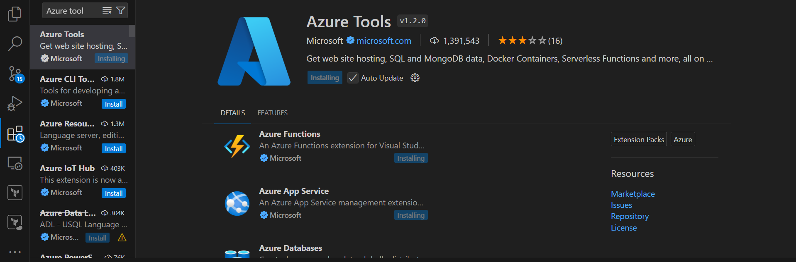

# Pipeline in Azure Devops 

 * Pipelines in Azure Devops can be achived in two ways 
    * Classic Pipeline (UI)
    * YAML Pipeline  
 
 * YAML Pipelines are a form of Pipeline as a Code, they will have history and we can handle per branch or per release changes in a pipelines. 

# YAML Format 

 * YAML is a collection of key-value or name value pairs
 * YAML files generally have extension of `.yaml or .yml`
 * Basic
  ```
  <name>: <value>
  ``` 
 * the values in YAML are categorized in two ways 
   * scaler/simple types 
     * text 
        * single line: use single or double quotes 
        * multi line:    
     * number 
     * boolean: `yes, no, true, false`
   * complex types:
     * list/array 
     * map / directory / object   

# Azure Devops Pipeline Format/schema

 * Azure devops YAML schema 
   * refer: https://learn.microsoft.com/en-us/azure/devops/pipelines/yaml-schema/?view=azure-pipelines
 * Pipeline in Azure Devops represent the CI/CD Pipeline 
 * As of now lets just focus on steps.
 * Each steps generally refers to activities which are to be performed in CI/CD Pipelines
 * In every Pipeline 
   * we need to express where the steps need to be executed
   * when should pipeline execute 
   * we need the express steps 
 * In Azure Devops pipeline a step can be achieved bu using 
   * task
   * direct commands (linux/windows)   
 * A task is an unit of work and there are lot of tasks provided by azure devops      
   * refer: https://learn.microsoft.com/en-us/azure/devops/pipelines/tasks/reference/?view=azure-pipelines

# Lets create a pipeline for springpetclinic 

 * Import from github into Azure source repo 
   * refer: https://github.com/spring-projects/spring-petclinic 
 * Ensure azure tools extension is installed in visual studio code 
         
   * for minimal just install Azure Pipeline extension
   * create a new file called as `azure-pipelines.yaml`
   
   ```
   ---
   pool: 
     name: Default 
   
   steps: 
     - tasks: Maven@4
       inputs:
         mavenPOMfile: 'pom.xml'
         goals: 'package'
   ``` 
   
   * create a pipeline in Azure Devops  